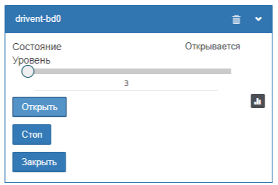

# WB-Drivent
Скрипт виртуального устройства для  WirenBoard

Как подключить:
1. В самих устройствах Drivent необходимо настроить подключение к MQTT
2. Скопировать скрипт wb-drivent.js на устройство WirenBoard в папку /mnt/data/etc/wb-rules
3. Открыть скрипт редактором и во второй строке для переменной driventsName задать имена и заголвоки Ваших устройств Drivent
   
```js
(function (){
  var driventsNames = {'drivent-bdc':'Гостиная (drivent)', 'drivent-bd0':'Гостевая (drivent)'}
  var virtualDeviceBodyTemplate =
	{

 ...

```
 
5. После сохранения на панели устройств появятся одноименные устройства с элементами управления


